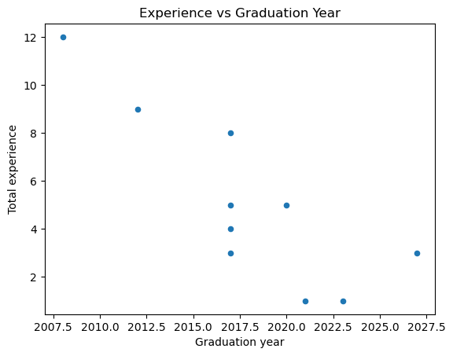

# Resume Parsing with OpenAI GPT-4

This project is designed to automate the parsing of resumes using the OpenAI GPT-4 API. It takes PDF resumes from a specified folder, extracts their text, and sends them to the OpenAI API for structured parsing. The goal is to extract essential fields such as name, email, skills, experience, education, and work history into a JSON format for further analysis.

## Features

- **Resume Parsing**: Automatically extracts and parses resumes in PDF format.
- **OpenAI GPT-4 Integration**: Utilizes OpenAI's GPT-4 to parse resumes and return structured data.
- **Structured Output**: Extracts key fields like Name, Email, Mobile Number, Skills, Degree, Total Experience, University, and Work History.
- **Error Handling**: Handles non-JSON responses and potential issues with resume parsing.

## Prerequisites

Before running this project, make sure you have the following installed:

- **Python 3.x**
- **OpenAI Python Client** (`openai`)
- **PyPDF2**: For extracting text from PDF files
- **Other Libraries**: `os`, `json`

Install the required dependencies using:

```bash
pip install openai pypdf2
```

## Setup

1. **Clone the Repository**:
   
   ```bash
   git clone https://github.com/your-repo/resume-parser.git
   cd resume-parser
   ```

2. **Set up OpenAI API Key**:
   
   Ensure your OpenAI API key is stored as an environment variable to keep it secure. Create a `.env` file (or set the environment variable directly in your system):
   
   ```bash
   OPENAI_API_KEY="your-openai-api-key"
   ```

3. **Configure the Folder Path**:
   
   Place the PDF resumes you want to parse in a folder. Set the path to the folder in the `folder_path` variable in the script:
   
   ```python
   folder_path = './Resumes/NewResumes'  # Update this with your folder path
   ```

## Usage

To run the resume parsing script, follow these steps:

1. **Extract and Analyze Resumes**:

   The script will extract text from all PDF resumes in the specified folder and send them to the OpenAI API for structured parsing.

   ```python
   # Set up OpenAI API client
   client = OpenAI(
       api_key=os.environ.get("OPENAI_API_KEY"),
   )

   # Run the parsing function
   parsed_resumes = parse_resumes_in_folder(folder_path)

   # View the parsed resumes
   for resume in parsed_resumes:
       print(resume)
   ```

2. **Output**:

   The output will be a structured JSON-like format, containing fields like:

   - **Name**
   - **Email**
   - **Mobile Number**
   - **Skills**
   - **Number of Programming Languages**
   - **Total Experience**
   - **Degree**
   - **University**
   - **Graduation Year**
   - **Latest Company**
   - **Start Year at the Latest Company**

   Example Output:

   ```json
   {
     "Name": "Amie Claude",
     "Email": "amieclaude@email.com",
     "Mobile number": "(123) 456-7890",
     "Skills": ["Python", "Java", "SQL"],
     "Number of programming languages": 3,
     "Total experience": 5,
     "Degree": "B.S. in Computer Science",
     "University": "University of Pittsburgh",
     "Graduation year": 2020,
     "Latest company": "DICK's Sporting Goods",
     "Start year at the latest company": 2020
   }
   ```

## Code Breakdown

### 1. **OpenAI API Client Setup**:
   
   The API key is securely stored in an environment variable (`OPENAI_API_KEY`) and used to authenticate with the OpenAI API. We leverage the GPT-4 model for resume parsing.

### 2. **Text Extraction from PDF**:
   
   The `extract_text_from_pdf()` function reads PDF files using `PyPDF2` and extracts the text for further analysis.

### 3. **Analyzing the Resume**:
   
   The `analyze_resume()` function sends the extracted resume text to the OpenAI API. The response is expected in a structured format, and error handling is included for non-JSON responses or API failures.

### 4. **Batch Processing**:
   
   The `parse_resumes_in_folder()` function processes all PDFs in a specified folder. It extracts text, sends it to the OpenAI API, and stores the parsed data for each resume.

### Error Handling:
- If the OpenAI response is not in the expected JSON format, a warning is printed and the raw content is returned instead.
- Exceptions during API requests are caught and logged.


## License

This project is licensed under the MIT License - see the [LICENSE](LICENSE) file for details.


Here's the updated README that includes the four visualizations you mentioned:

---

# Resume Parsing with OpenAI GPT-4

This project automates the parsing of resumes using the OpenAI GPT-4 API. It extracts resume text from PDF files, sends them to the OpenAI API for structured parsing, and provides various visualizations based on the parsed data, such as skills distribution and total experience.

## Features

- **Resume Parsing**: Automatically parses resumes in PDF format.
- **OpenAI GPT-4 Integration**: Uses OpenAI's GPT-4 model to extract structured data from resumes.
- **Data Visualizations**: Provides insightful visualizations including skill distribution, total experience, experience vs. graduation year, and programming language distribution.

## Visualizations

1. **Skills Distribution by Candidate (Stacked Bar Chart)**:
   Visualizes the frequency of skills for each candidate using a stacked bar chart.
   
   
   ```python
   # Convert the skills into a Counter to get the frequency of skills per candidate
   skills_data = pd.DataFrame(df['Skills'].apply(Counter).tolist()).fillna(0)
   skills_data.index = df['Name']

   # Plotting the stacked bar chart
   ax = skills_data.plot(kind='bar', stacked=True, figsize=(10, 7))
   ax.set_title('Skills Distribution by Candidate')
   ax.set_ylabel('Frequency of Skills')
   plt.legend(bbox_to_anchor=(1.05, 1), loc='upper left')
   plt.tight_layout()
   plt.show()
   ```

2. **Total Experience by Candidate (Bar Chart)**:
   This bar chart shows the total work experience (in years) of each candidate.

   
   ```python
   import plotly.express as px
   fig = px.bar(df, x='Name', y='Total experience', title='Total Experience by Candidate')
   fig.show()
   ```

3. **Experience vs. Graduation Year (Scatter Plot)**:
   A scatter plot showing the relationship between graduation year and total experience for each candidate.
   
   
   ```python
   df.plot(kind='scatter', x='Graduation year', y='Total experience', title='Experience vs Graduation Year')
   plt.show()
   ```

4. **Distribution of Programming Languages Known (Pie Chart)**:
   Visualizes the distribution of the number of programming languages known by candidates using a pie chart.
   
   ```python
   df['Number of programming languages'].value_counts().plot(kind='pie', autopct='%1.1f%%', title='Distribution of Programming Languages Known')
   plt.show()
   ```

5. **Box Plot for Experience Distribution(Box Plot)**
    Visualizes the distribution of experience across candidates.

    
    ```python
    sns.boxplot(x='Total experience', data=df)
    plt.title('Distribution of Experience')
    plt.show()

    ```